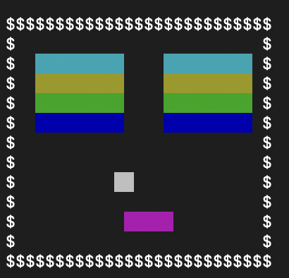

# ブロック崩し in Terminal　(ステージの自作可能)

## 環境
PC: macOS version 13.5.2
言語: ruby 3.2.1
その他: Excel version 16.78
※Excelに関しては自分でステージを作る際にあると便利になります。なくても作ることができます。
## こだわり
- ターミナルで実行できるゲーム。
- Excelを用いることで視覚的に簡単にステージを作ることができる。

## 使い方
### インストール方法
```sh
git clone https://github.com/bluecat101/Block-Breck.git
```
もしくは
zipファイルでダウンロード
### 実行方法(ブロック崩し)
```sh
ruby block_break.rb
```
### 実行方法(ステージの作成)
1. Excelをマクロ有効モードで開く
2. 概要シート、サンプルシートをもとに自作シート等(新しいシートに追加してもOK)にステージを描く。
3. その作成したシートを開いた状態で、make_dataのマクロを実行する
4. 作成されたdataシートの長い文字列の部分をコピーしtest.txtに貼る
### 操作方法
- 左キー、右キーで棒を移動させる
